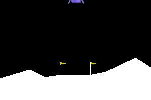
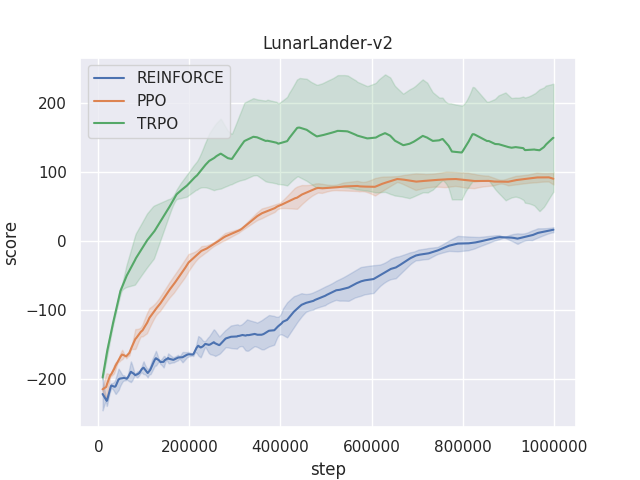
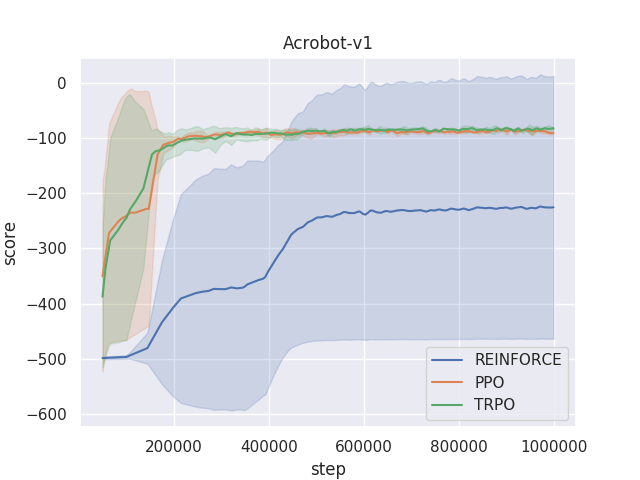
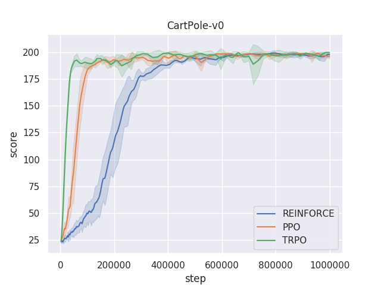

# PolicyGradients

Pytorch single thread implementation of REINFORCE, Trust Region Policy Optimization (TRPO) & Proximal Policy Optimization (PPO).

## LunarLander-v2

  

  

## Acrobot-v1

  

  

## CartPole-v0

  

  

## Train

## Test

## Plot
